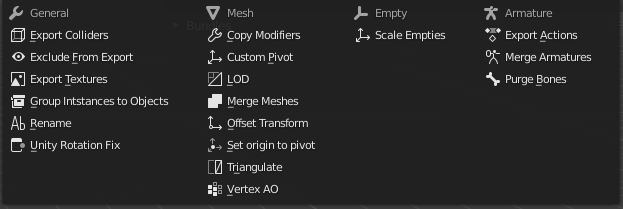
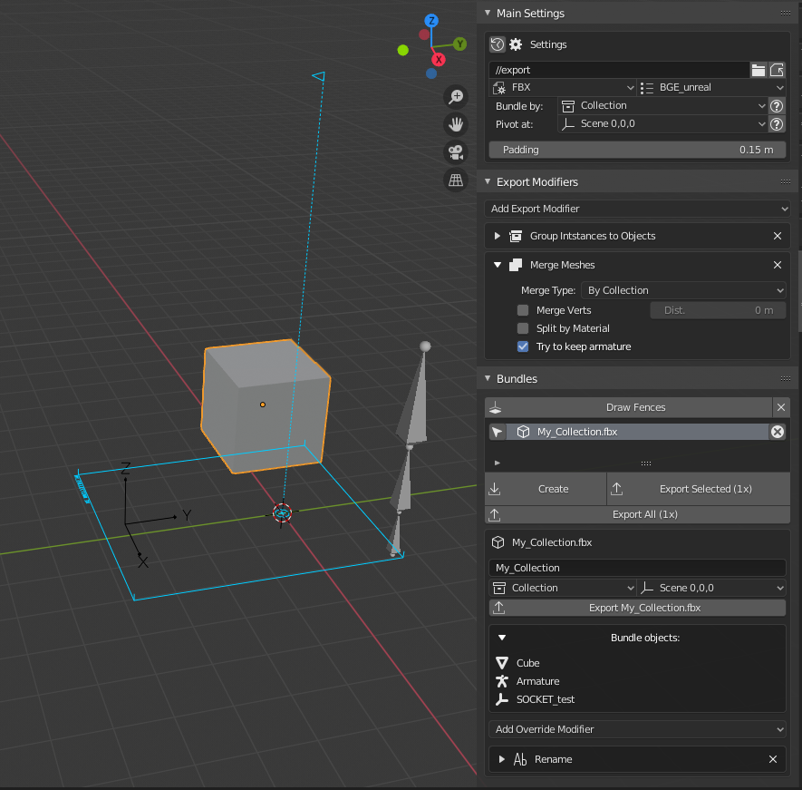
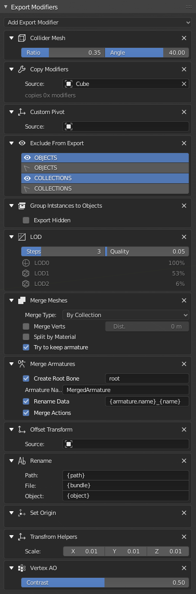

# Bundle Exporter

This is a fork of [**FBX Bundle**](https://bitbucket.org/renderhjs/blender-addon-fbx-bundle/src/master/) [(doc)](http://renderhjs.net/fbxbundle/) ported to **Blender 2.8** and with many new features.

The main difference from the original addon is that the bundles are stored in the scene, objects don't have to be selected to be able to export a bundle. This project also added support for **armatures**, **empties** and **instanced collections**.
To see all the new features and changes take a look at the [***changelog***](CHANGELOG.md)

