# RigOnTheFly
Version : 1.0.0

Rig on the Fly is a Blender 2.80 dynamic rigging tool used to simplify and speed up animation workflow.  
Inspired by Richard Lico's GDC 2018 talk: [Animating Quill: Creating an Emotional Experience](https://www.youtube.com/watch?v=u3CzLVpuE4k&t=2011s) and his Animation Sherpa Space Switching course.  
  
The main goal of Rig on the Fly is to facilitates animators job by automating repetitive tasks such as rigging. It does so by modularizing the rig allowing changes to how it functions on the fly without losing motion. Letting animators focus on performance rather than find ways to circumvent rig limitations.

Rig on the Fly is the result of my brother's and my free time, used to improve my personal animation workflow. We are sharing this tool in case it helps others animate in Blender 3D.  
If you have any questions or suggestions you can contact us on dypsloom's [discord](https://discord.gg/guN9QXn) and through twitter @dypsloom and @Wardl_ .
You can also check other cool things that we do on [dypsloom.com](https://dypsloom.com/).

The tool pairs very well with another one called [AnimAide](https://github.com/aresdevo/animaide).  

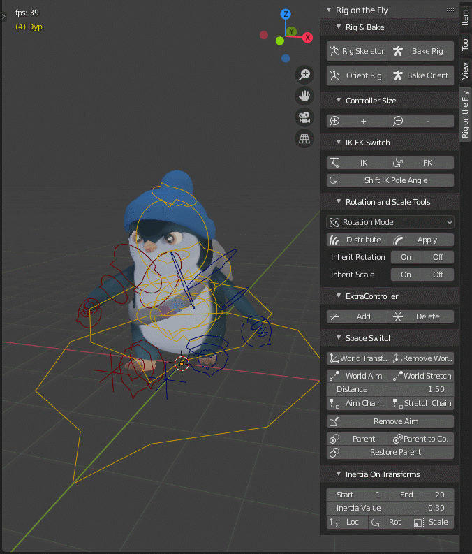

### Compatibility
Blender 2.8x  
Blender 2.90  

### Known Issues   
If an animation uses exagerated non-uniform scale transforms, baking the animation can look different.  
Having two-bone ik chain's axis not perpendicular to where the bend points and/or the bend is not clear enough it can mess up the IK Pole vector.  
Aim Offset can modify how animations look when controllers up the hierarchy are scaled.

### Features to Fix/Improve 
Make IK work with completely straight limbs.  

### Future Features 
Restore parent of ".child.rig" controllers by selecting the parent controller.  
Y only rotation distribution for roll controls.  

### Instalation
Go to the following address [https://gitlab.com/dypsloom/rigonthefly](https://gitlab.com/dypsloom/rigonthefly) and download the addon to a chosen folder on your computer.   

Then in Blender, go to "Add-ons" tab on the preference window. There click on the "Install" button and navigate to the folder where you downloaded the addon. Choose the RigOnTheFly file and it will be installed.

Make sure the addon check-mark is active.

Once installed you can find the RigOnTheFly panel on the right side of your 3d view in Sidebar. Press N to Toggle Sidebar visibility or click on the small arrow pointing left on the top right part of your 3d view.

At the moment RigOnTheFLy has the following features. 

## Rig & Bake

### Rig Skeleton

Adds basic FK controllers to a selected armature. Keeping any animation keys it had.

### Bake Rig

Applies the rig's animation on to the base armature and removes all controllers created by RigOnTheFly. Usually used once you are ready to export your animation but can also be used to reset the rig's controls.

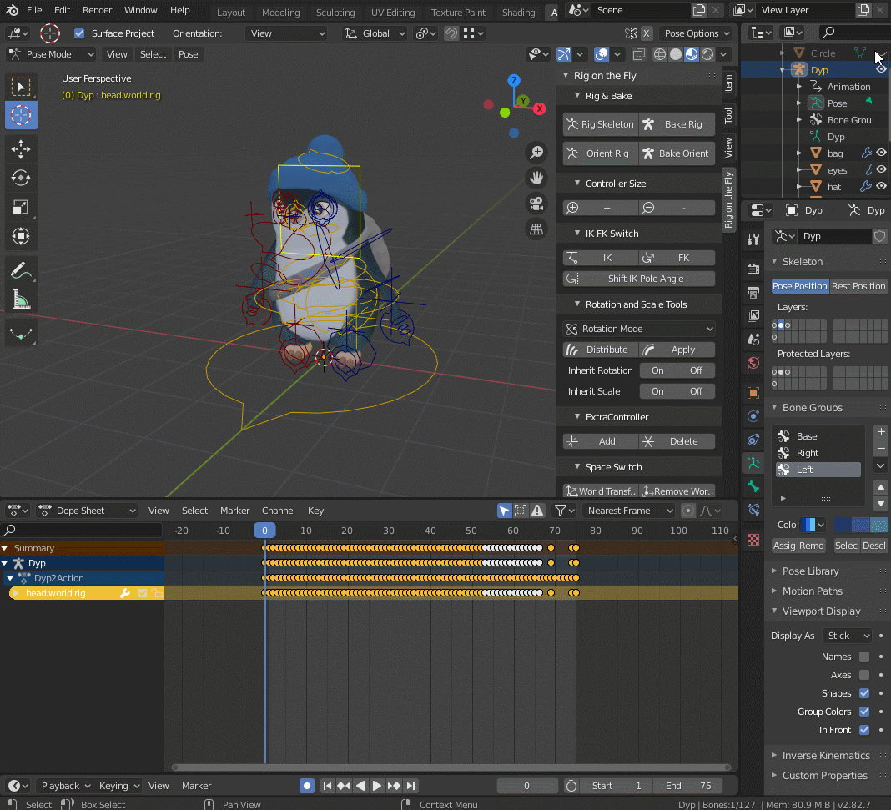

### Orient Rig/Bake

In case your armature was imported from another 3d software use **Orent Rig** to make it compatible with **RigOnTheFLy**. If your imported armature does not have animations yet, make sure to key all bones once before pressing **Orient Rig** to prevent unwanted rotations.
**Bake Orient** is the equivalent to **Bake Rig** but for armatures that used **Orient Rig** first.

**Rig Skeleton** and **Orient Rig** both key the rig into bind pose (T-pose) at frame 0 so that the whole RigOnTheFly tool works correctly. Animate from frame 1 and onwards to avoid issues.

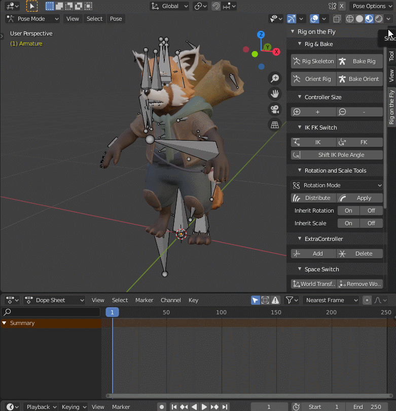

The character and rig of Baqir (the red panda) is from Richard Lico's @Foofinu Animation Sherpa's course. Character model made by LeoOgawaLillrank @LeoOgawa.

### Proxy Rig/Bake

If you are working with proxy rig, use the **Rig Proxy** button to make an editable copy of the selected rig that is compatible with **Rig On The Fly**.  
Use **Bake Proxy** to apply the animation onto the proxy rig when needed.

## Rig Layer Settings

Rig Layer Settings lets you decide in advance to which bone layer Rig On The Fly sends bones.  
  
Base Bones : Where bones that are directly driven by rig bones are sent to.  
Controllers : Where rig bones used for animation are sent to.  
Unused Controllers : Where temporarly unused rig bones are sent to.  
  
The next two layers are only relevant if using Orient Rig.  
  
Unoriented Bones : Where not-oriented bones are sent to.  
Translator Bones : Where bones used to translate rig bones motion to not-oriented bones are sent to.

## Settings

### Controller Size

Increase or decrease selected controllers' size to your liking. Does not affect animation in any way.

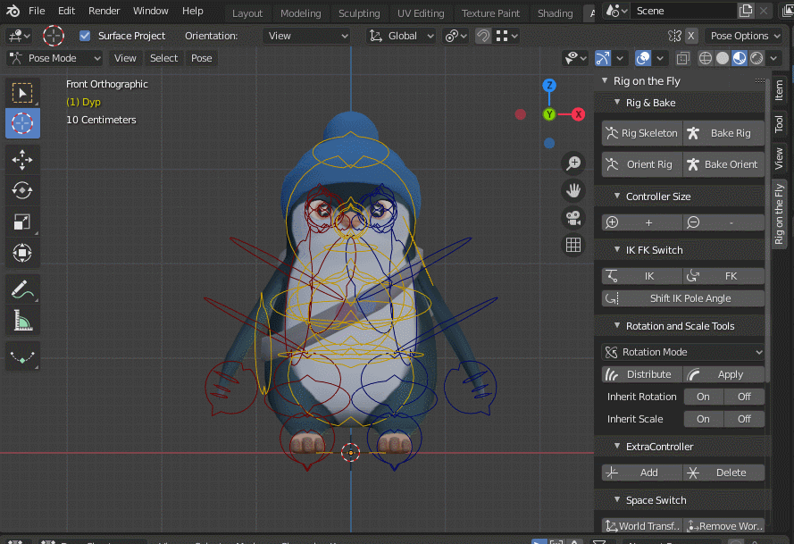

### Smart Channels OFF

if Smart Channels is turned OFF, any baking will add keys to all transforms as it does by default. 

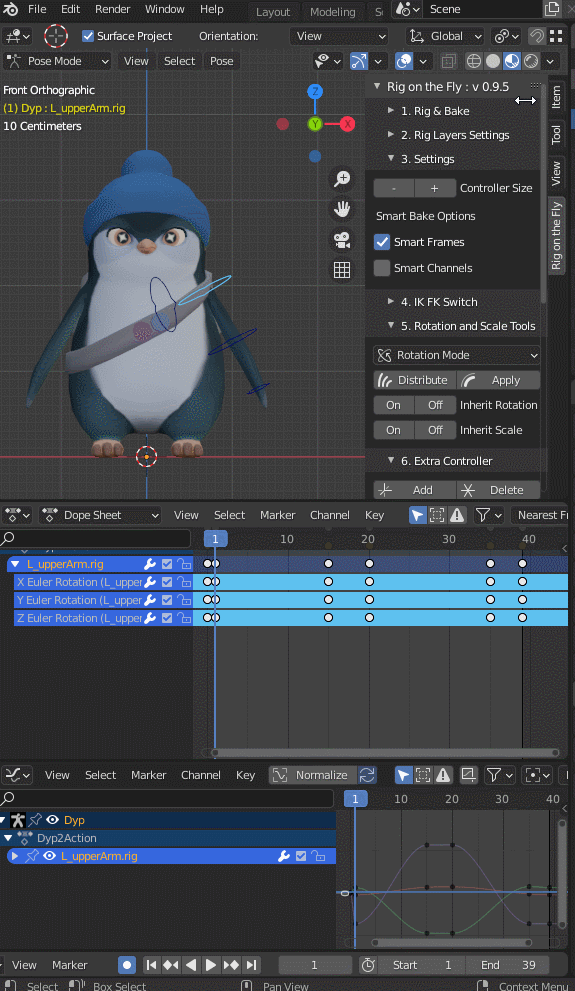

### Smart Channels ON
When Smart Channels is turned ON, any baking will result in keys only on used transform channels. Ideal when working with animation layers.  

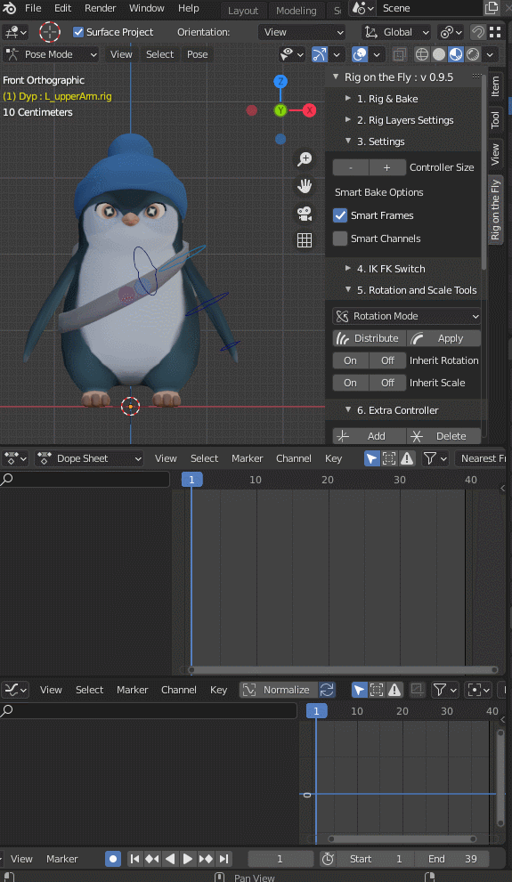

### Smart Frames OFF

With the Smart Frames setting turned OFF, any changes to the rig using *RigOnTheFly* will result in keeping the pre-existing motion using Blender's regular bake operation.

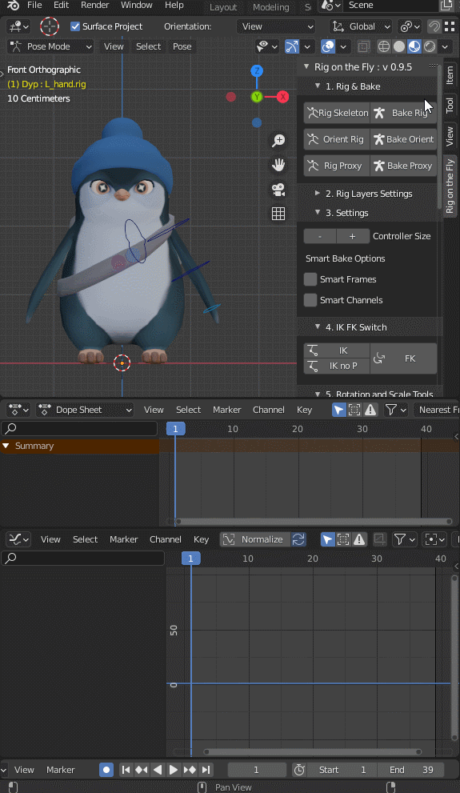

### Smart Frames ON

When Smart Frames is turned ON, any changes to the rig using *RigOnTheFly* will result in keeping *only* the relevant keyed poses from the pre-existing motion.  
This setting is ideal for the early stages of an animation preventing too many keys from clogging the timeline.

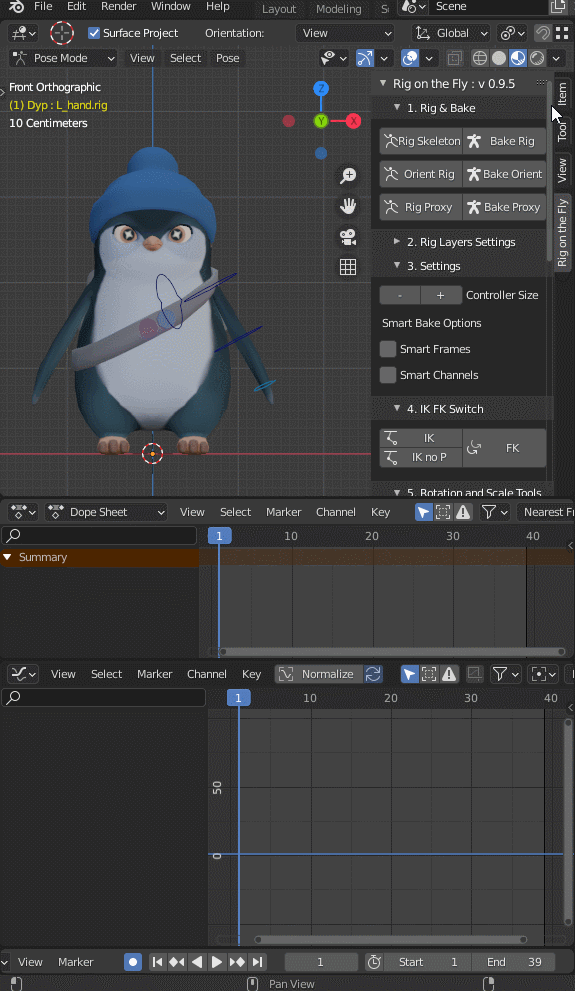

### Controller Shapes
Adds all RigOnTheFly's controller shapes to the blender file.  

## Keyframes

### Key Range 
Key Range keys available tranforms between the Start and End frames. Ideal for keeping a particular motion while working with Smart Range ON. Increase the Step to add keys every 2 or more frames. 

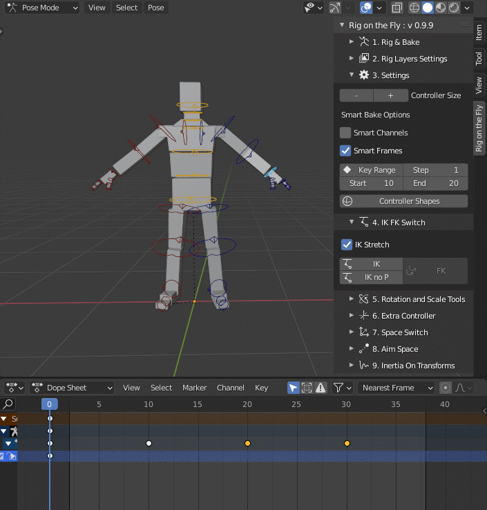

### Offset keys
Offset seleced keys down the selection order.

## IK FK Switch

The following is for two bones IK only. 
IK switches selected controllers to work in Inverse Kinematic/IK with pole tragets. Can shift the animation if part of the two bones chain uses more than one rotation axis (it happens regularly in motion capture animation).
If regular IK is changing your animationin an unwanted way, maybe try IK no P. It does the same as IK except it does not add pole targets.  
Leaving IK Stretch ON enables the chain to scale on the Y axis.  
To switch back to FK, simply select the desired IK handles and press the FK button.  

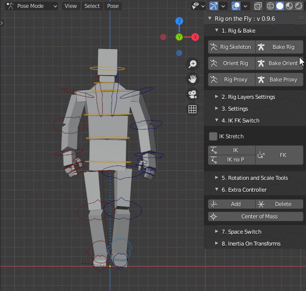

## Rotation and Scale Tools

### Rotation Mode

Changes selected controllers rotation mode without modifying the animation.

### Distribute

Distributes rotation between the first and last selected controllers without modifying the existing animation. *Disables translation of top controller.
After selecting the top controller, press **Apply** to return to how it was.

### Inherit Rotation/Scale

Pressing **On** enables selected controllers to inherit rotation/scale transforms from their parents. Pressing **Off** disables it.

## Extra Controller

Adds a world space crosshair controller at the center of your scene.  
**Delete** removes **any** selected controller. (careful not to remove controllers you need)

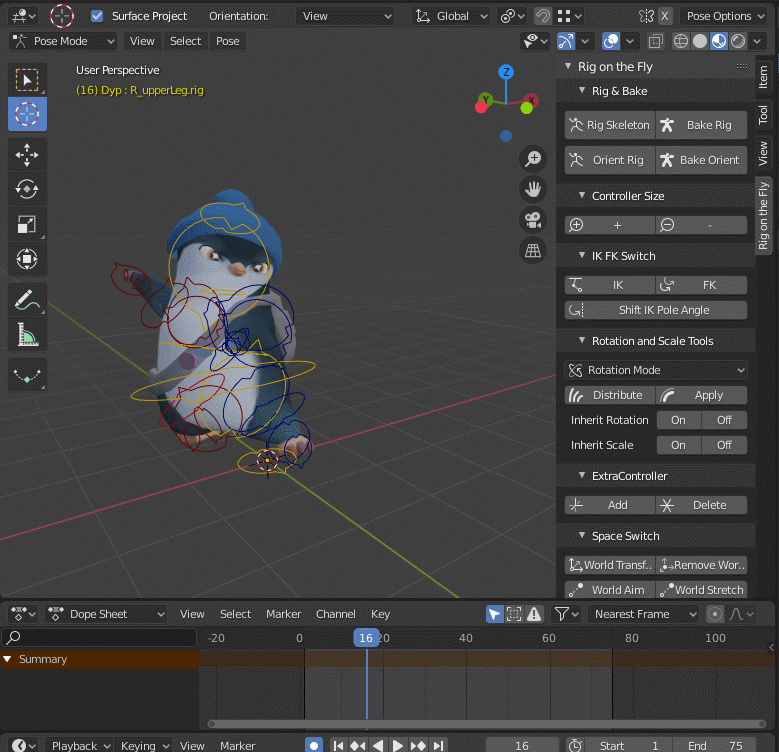

## Center of Mass
Adds a CoM (Center of Mass) controller constrained between the selected bones. Under the propreties of CoM bone you can edit the influence weight. Ideal to visualise the center of mass of a character. Works on non RigOnTheFly bones as well.

It pairs well with Parent Copy to cleanup the CoM's trajectory.

## Space Switch

### World Transform

Chanages selected controllers to function in world space. So for example, putting their location to (0,0,0) will put them at the center of the scene regardless of if the Armature object is placed somewhere else. They are also no longer affected by their parent.
Pressing **Remove** will restore the seleced controllers.

### Parent

Parent selected controllers to the active controller.

### Parent Copy

Parent selected controllers to a copy of the active controller. Contrary to **Parent**, **Parent Copy** lets you parent to motion down the hierarchy. Ideal for ball foot/toe pivot or three limbs IK.

## Aim Space

### World Aim/Stretch

Makes selected controllers aim at a world space locator placed in front of the designated axis.
Change the value of **Distance** for the space locator to be placed closer or futher once you press **World Aim** or **World Stretch**.

**World Aim** affects only rotation as **World Stretch** affects scale as well.

### Aim Offset

Makes selected controllers aim at a locator placed at the 3d Cursor's position taking into account the offset. 

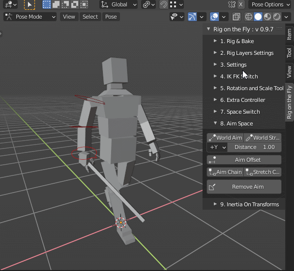

### Aim/Stretch Chain

**Aim Chain** and **Stretch Chain** changes selected controllers to rotate aiming/stretching down the hierarchy of selected bones and switches their position to world space.

### Simple Constraints
Under Simple Constraints **Aim Chain** and **Stretch Chain** only adds an Aim Constraint down the selection order.

## Inertia On Transforms

Applies **Inertia Value** to the X,Y and Z of the location, rotation or scale of selected controllers. 
Higher **Inertia Value** will make the controllers take longer to change dirrection.

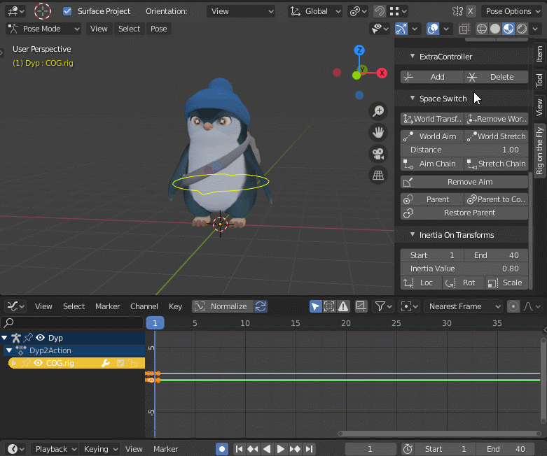

